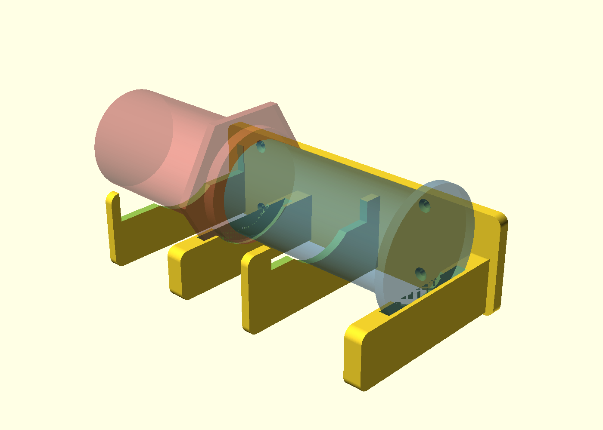

# AeroPress Wandhalter – Entnahme nach vorne

Halter für die **normale AeroPress** an der Holzwange der Kaffeeecke.
Beide Teile liegen waagerecht **hintereinander mit der Achse zum
Betrachter** und werden **nacheinander nach vorne** entnommen – nichts
muss mehr seitlich an der großen AeroPress vorbeigefädelt werden.



## Funktionsprinzip

Jedes Teil liegt auf zwei Kamm-Scheiben:

1. **Profil-Scheibe** (12 mm dick, dreilagig ausgeschnitten):
   Der runde **Griffteller des Kolbens** bzw. der **Sechskant-Flansch
   des Korpus** fällt in eine passgenaue Profil-Nut (rund bzw.
   Sechskant – wie beim bisherigen Halter). Die Nut sperrt das Teil
   axial in beide Richtungen: Es kann weder nach vorne herausrutschen
   noch nach hinten geschoben werden.
2. **Sattel-Scheibe** weiter vorne: trägt das Rohr. Das Maul ist
   oberhalb der Mulde verbreitert, damit Teller bzw. Flansch beim
   Herausziehen hindurchpassen.

**Entnahme:** Teil ca. **2 cm anheben** und gerade **nach vorne
herausziehen**. Erst den Korpus (vorne), dann den Kolben – der Kolben
gleitet dabei über die dann leeren vorderen Scheiben hinweg.
Einsetzen in umgekehrter Reihenfolge (Kolben lässt sich auch bei
eingesetztem Korpus von oben einlegen).

Der Korpus liegt mit dem Sechskant-Flansch hinten (Trinkrand zur
Wand, Filterdeckel nach vorn), der Kolben mit dem Griffteller hinten.
Beim Sechskant eine **Flächenseite nach unten** drehen, dann setzt
sich der Flansch satt in die Nut.

## Dateien

| Datei | Inhalt |
|---|---|
| `aeropress-wandhalter.scad` | Parametrisches OpenSCAD-Modell |
| `aeropress-wandhalter.stl` | Druckfertiges Mesh |
| `preview-schraeg.png`, `preview-vorne.png` | Vorschau (transparent: AeroPress zur Passkontrolle) |

## Maße – bitte vor dem Druck nachmessen!

Die AeroPress-Maße stehen als Variablen am Dateianfang. Offizielle
Herstellerangaben sind eingearbeitet (Korpus 121 mm lang, Sechskant
107,2 mm über Eck ≙ 92,8 mm Schlüsselweite; Kolben 133 mm lang,
Teller Ø 83,3 mm). **Mit Messschieber prüfen:**

| Variable | angenommen | messen |
|---|---|---|
| `chamber_tube_d` | 70 mm | Rohr-Außen-Ø des Korpus |
| `chamber_hex_af` | 92,8 mm | Sechskant-Flansch: Schlüsselweite (Fläche zu Fläche) |
| `chamber_stub_d` | 76 mm | Ø des Kragens zwischen Trinkrand und Flansch |
| `chamber_flange_pos` | 8 mm | Abstand Trinkrand → Flansch |
| `plunger_tube_d` | 63 mm | Rohr-Außen-Ø des Kolbens |
| `plunger_rim_d` | 83,3 mm | Griffteller-Ø |
| `plunger_len` / `chamber_len` | 133 / 121 mm | Gesamtlängen |
| `flange_t` | 6 mm | Dicke von Teller und Flansch |

Die Mulden haben 2,2–2,4 mm Spiel; kleine Abweichungen sind also
unkritisch. STL neu erzeugen:

```sh
openscad --export-format binstl -o aeropress-wandhalter.stl aeropress-wandhalter.scad
```

## Platzbedarf

- Rückplatte: **230 mm tief × 67 mm hoch**, 8 mm dick;
  Scheiben ragen **122 mm** von der Holzwange ab.
- Der Korpus steht vorne ca. 40 mm über die Rückplatte hinaus.
- Über den Teilen ca. **4 cm Luft** lassen (Anheben zur Entnahme);
  höchster Punkt ist der Sechskant-Flansch bei ~96 mm über
  Plattenunterkante.

## Druck

| Parameter | Empfehlung |
|---|---|
| Material | PETG oder PLA |
| Ausrichtung | Aufrecht auf der hinteren Stirnseite (y=0) stehend – die Scheiben liegen dann als waagerechte Platten übereinander |
| Stützstruktur | Baumstützen (Bauplatte + Modell) unter den drei vorderen Scheiben, Brim |
| Wandlinien | 4 |
| Füllung | 25–30 % |
| Schichthöhe | 0,2 mm |

## Montage

Mit 4 Senkkopf-Holzschrauben 4 × 25 mm an die Holzwange schrauben
(Löcher Ø 4,5 mm, Senkungen sind vorgesehen). Achsen zeigen zum
Betrachter, Halter waagerecht ausrichten.
