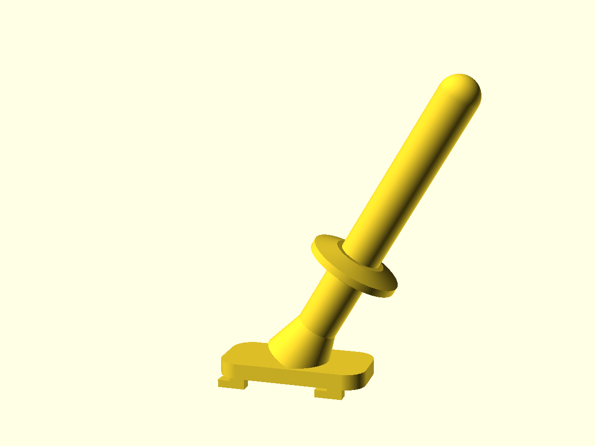

# SKÅDIS Flaschenhaken – Trocknungshaken für Fahrrad-Trinkflaschen

Ein minimalistischer, 3D-druckbarer Haken für die **IKEA SKÅDIS** Lochplatte.
Gespülte Fahrrad-Trinkflaschen werden **ohne Deckel kopfüber** mit der Öffnung
auf den schrägen Stab gesteckt und können dort abtropfen und trocknen –
ideal über der Spüle montiert.



## Funktionsprinzip

- Der Stab (Ø 16 mm) steht **30° nach oben geneigt** von der Platte ab. Die
  Flasche wird kopfüber aufgesteckt und hält allein durch die Schwerkraft.
- **500-ml- und 750-ml-Flaschen** passen auf denselben Haken: Beide Größen
  haben den gleichen genormten Flaschenhals (Öffnung innen ca. 30–36 mm),
  sie unterscheiden sich nur in der Höhe.
- Der **Stopp-Kragen** (Ø 36 mm) bei 45 mm hält den Flaschenrand auf Abstand
  zum Board: Luft kann in die Flasche zirkulieren, die Flasche berührt die
  Lochplatte nicht, und Tropfwasser fällt frei nach unten in die Spüle.
- Die runde Spitze erleichtert das Aufstecken mit einer Hand.

## Dateien

| Datei | Inhalt |
|---|---|
| `flaschenhaken.scad` | Parametrisches OpenSCAD-Modell (alle Maße anpassbar) |
| `flaschenhaken.stl` | Druckfertiges Mesh |
| `preview-seite.png`, `preview-front.png` | Vorschau-Renderings |

## Montage (werkzeuglos)

1. Beide Clips auf der Rückseite in zwei **übereinanderliegende**
   SKÅDIS-Schlitze (40-mm-Raster) einstecken.
2. Haken ca. 5 mm **nach unten schieben** – die Haken greifen hinter die
   Platte und verriegeln den Halter.
3. Zum Abnehmen: anheben und herausziehen.

Pro Flasche einen Haken drucken; im 40-mm-Raster der SKÅDIS-Platte lassen
sich mehrere Haken nebeneinander setzen (empfohlener Abstand: mindestens
zwei Lochspalten ≙ 80 mm, damit sich die Flaschen – Ø ca. 74 mm – nicht
berühren).

## Druckeinstellungen

| Parameter | Empfehlung |
|---|---|
| Material | **PETG** (feuchtraumtauglich, zäh); PLA funktioniert auch |
| Ausrichtung | **Auf der Seite liegend** (90° gedreht), damit die Druckschichten längs des Stabs verlaufen → maximale Biegefestigkeit |
| Stützstruktur | Ja (Baumstützen), nur unter Clips, Stab und Kragen nötig |
| Wandlinien | 4–5 |
| Füllung | 25–30 % |
| Schichthöhe | 0,2 mm |

**Wichtig:** Nicht aufrecht stehend drucken – dann verlaufen die Schichten
quer zum Stab und er kann bei Belastung an einer Schichtgrenze brechen.

## Maße & Anpassung

Alle Maße sind Variablen am Anfang von `flaschenhaken.scad`:

| Variable | Wert | Bedeutung |
|---|---|---|
| `rod_d` | 16 mm | Stabdurchmesser (muss kleiner als die Flaschenöffnung sein) |
| `rod_len` | 120 mm | Stablänge |
| `rod_angle` | 30° | Neigung nach oben |
| `collar_d` / `collar_pos` | 36 mm / 45 mm | Stopp-Kragen: Durchmesser und Abstand von der Platte |
| `plate_w` / `plate_h` / `plate_t` | 28 / 58 / 6 mm | Grundplatte |
| `board_t` | 5,1 mm | SKÅDIS-Plattenstärke |
| `tab_w` | 4,6 mm | Clipbreite (SKÅDIS-Schlitz: 5 × 15 mm) |

STL neu erzeugen nach Änderungen:

```sh
openscad --export-format binstl -o flaschenhaken.stl flaschenhaken.scad
```

## Belastung

Eine leere 750-ml-Flasche wiegt ca. 80–100 g – die Hebelbelastung auf Clips
und Stab ist minimal. Der Haken trägt in Seitenlage gedruckt (PETG) auch
problemlos eine volle Flasche.
